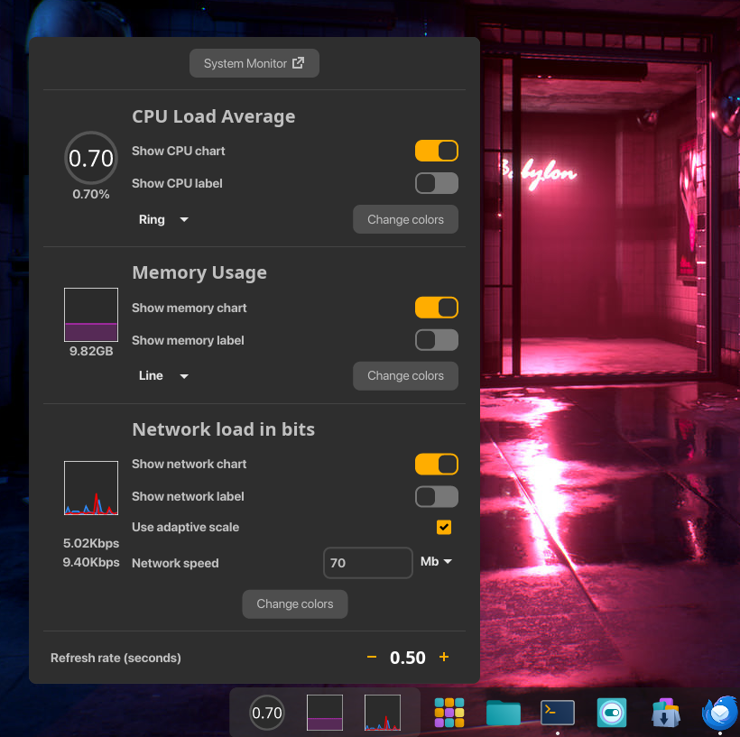

# Minimon COSMIC Applet

A configurable applet for displaying the following:
* CPU load
* CPU temperature
* Memory usage
* Network utilization
* Disk activity
* GPU and VRAM usage on Nvidia and AMD GPUs. 

Can sit in the panel or Dock. Configurable refresh rate and many display options.




## Installing
If on a .deb based distibution download [latest version](https://github.com/Hyperchaotic/minimon-applet/releases) and install with the following commands:

```sh
sudo dpkg -i cosmic-applet-minimon_0.3.10_amd64.deb
```

## Building

To build the applet, you will need [just](https://github.com/casey/just) and probably xkbcommon, if you're on Pop!\_OS, you can install it with the following command:

```sh
sudo apt install just libxkbcommon-dev
```

Run the following commands to build and install the applet:

```sh
just build-release
just install
```

Alternatively generate a deb or rpm file for installation:

```sh
just build-release
just deb
just rpm
```
and install with:

```sh
sudo dpkg -i <name_of.deb>
sudo dnf install <name_of.rpm>
```

For checking logs:

```
journalctl SYSLOG_IDENTIFIER=cosmic-applet-minimon
```
